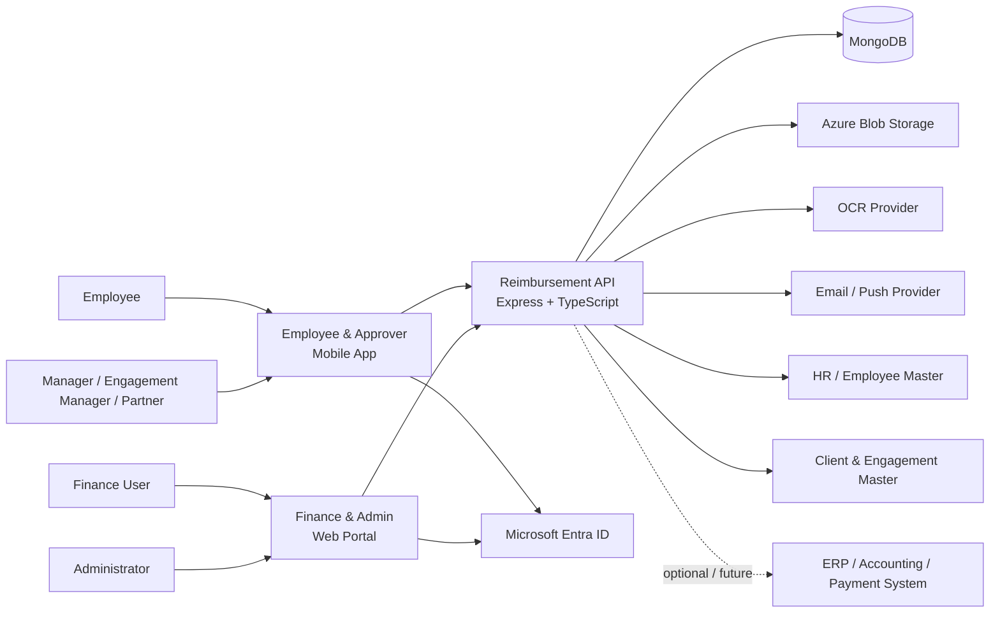
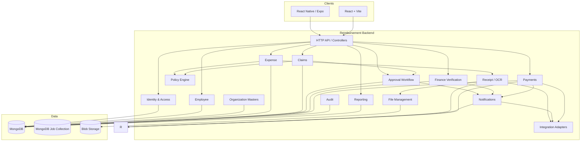
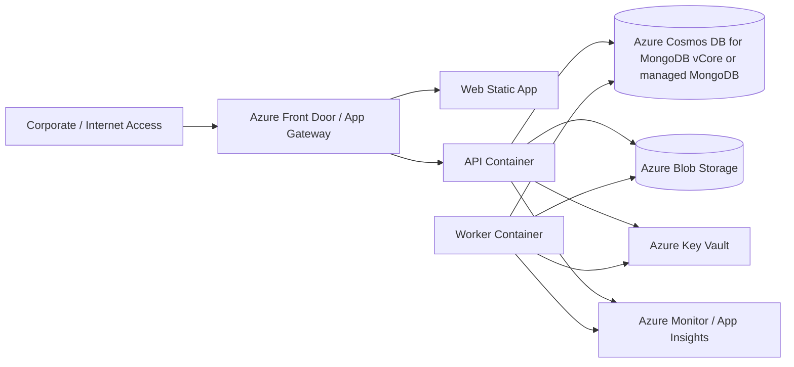
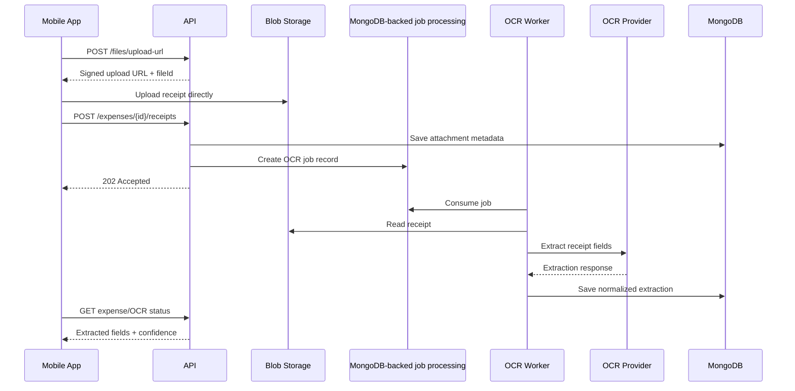
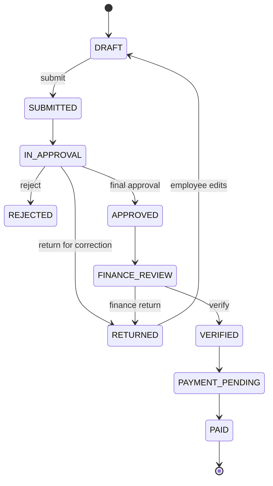
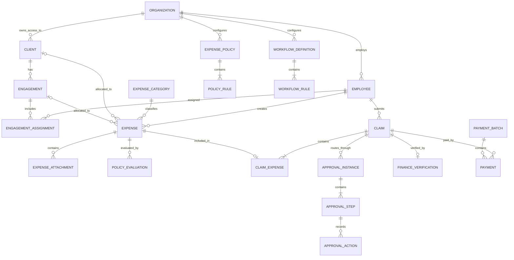
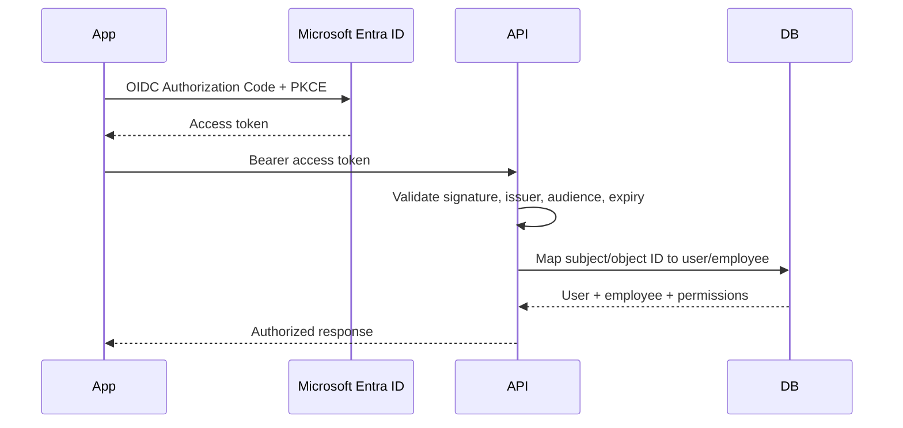
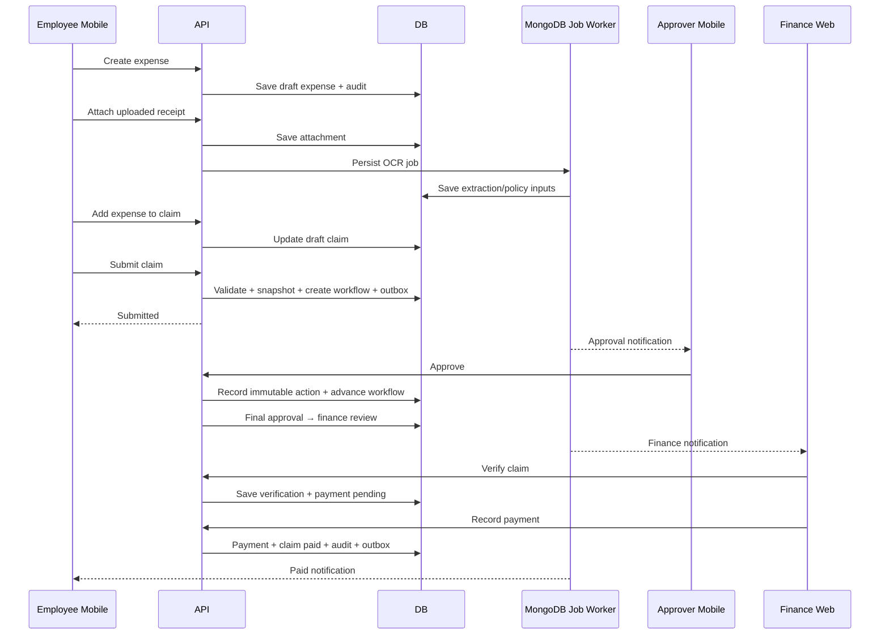

# Technical Design Document (TDD)

## Employee Reimbursement Management System — Audit Firm

**Version:** 1.0  
**Status:** Draft / Architecture Baseline  
**Date:** 23 August 2026  
**Related Documents:** `01-BRD.md`, `02-PRD.md`, `03-FRD.md`

---

## 1. Purpose

This Technical Design Document defines the implementation architecture for the Employee Reimbursement Management System used internally by an audit firm.

The system provides:

- Employee and approver mobile experience
- Finance and administration web portal
- Receipt capture and OCR
- Client and engagement allocation
- Expense policy evaluation
- Configurable approval workflows
- Finance verification
- Payment recording and reconciliation readiness
- Notifications
- Reporting
- Complete, immutable audit history

This document translates the BRD, PRD and FRD into a deployable technical solution and establishes architectural boundaries, data ownership, API conventions, security controls, integration patterns and implementation standards.

---

## 2. Design Goals

The solution SHALL be designed for:

1. **Auditability** — all material actions must be attributable and historically reconstructable.
2. **Security** — employee, financial and client information must be protected by least-privilege access.
3. **Mobile-first expense capture** — creating an expense should require minimal manual data entry.
4. **Configurable business rules** — policy thresholds and approval routing should not require code changes.
5. **Clear transaction ownership** — one backend is the source of truth for expenses, claims, approvals and payment status.
6. **Integration isolation** — OCR, identity, notification and payment/ERP providers must be accessed through adapters.
7. **Operational resilience** — failures in OCR, email or notification services must not corrupt reimbursement transactions.
8. **Scalability without premature microservices** — begin as a modular monolith with independently separable modules.
9. **No hard deletion of financial workflow records**.
10. **Traceability** from business requirement to functional requirement, API, module and test.

---

## 3. Architecture Decision Summary

| Area | Decision |
|---|---|
| Architecture style | Modular monolith, domain-oriented |
| Mobile | React Native + Expo + TypeScript |
| Finance/Admin Web | React + Vite + TypeScript |
| Backend | Express.js + TypeScript |
| API | REST/JSON, OpenAPI 3.x contract |
| Database | MongoDB |
| ODM/query layer | Mongoose; MongoDB aggregation pipelines for reporting |
| Background processing | MongoDB-backed job collection + lightweight worker only where asynchronous processing is required |
| File storage | Azure Blob Storage |
| Employee authentication | Microsoft Entra ID via OIDC/OAuth 2.0 |
| Authorization | Application RBAC + scoped permissions |
| OCR | Provider adapter; Azure AI Document Intelligence recommended initial provider |
| Notifications | Push + email; provider adapters |
| Push notifications | Firebase Cloud Messaging / Expo Notifications abstraction |
| Observability | OpenTelemetry + centralized logging + error tracking |
| Hosting | Microsoft Azure |
| Runtime | Containers; Azure Container Apps initially or AKS if organizational platform requires Kubernetes |
| CI/CD | Azure DevOps or equivalent pipeline |
| IaC | Terraform or Bicep |
| API versioning | `/api/v1/...` |
| Monetary representation | Integer minor units (paise/cents) or MongoDB Decimal128; never binary floating point |
| Date/time storage | UTC timestamps; business dates stored separately as `date` where appropriate |

---

## 4. System Context



---

## 5. High-Level Component Architecture



---

## 6. Deployment Topology

### 6.1 Initial Production Topology



### 6.2 Runtime Units

- **Web** — static React application.
- **API** — synchronous HTTP APIs and authorization boundary.
- **Worker** — asynchronous jobs such as OCR, notifications, exports and integration retries.
- **MongoDB** — transactional source of truth.
- **Blob Storage** — receipts, supporting documents and generated exports.

The API and Worker SHALL be independently scalable.

---

## 7. Repository Structure

Recommended monorepo:

```text
reimbursement/
├── apps/
│   ├── api/                      # Express.js + TypeScript HTTP application
│   ├── worker/                   # MongoDB-backed worker
│   ├── web/                      # React/Vite Finance & Admin portal
│   └── mobile/                   # React Native/Expo application
│
├── libs/
│   ├── contracts/                # Shared API schemas/types where safe
│   ├── common/                   # Generic helpers, errors, primitives
│   ├── config/                   # Typed configuration
│   ├── observability/            # Logging, tracing, metrics
│   ├── database/                 # Mongo client/Mongoose, indexes, transaction helpers
│   ├── auth/                     # AuthN/AuthZ primitives
│   ├── employee/
│   ├── master-data/
│   ├── expense/
│   ├── receipt/
│   ├── policy/
│   ├── claim/
│   ├── approval/
│   ├── finance/
│   ├── payment/
│   ├── notification/
│   ├── reporting/
│   ├── audit/
│   └── integrations/
│       ├── identity/
│       ├── ocr/
│       ├── hr/
│       ├── client-engagement/
│       ├── notification/
│       └── accounting/
│
├── packages/
│   ├── ui-web/
│   ├── ui-mobile/
│   ├── eslint-config/
│   └── tsconfig/
│
├── infrastructure/
│   ├── terraform/                # or bicep/
│   ├── docker/
│   └── pipelines/
│
├── docs/
│   ├── 01-BRD.md
│   ├── 02-PRD.md
│   ├── 03-FRD.md
│   ├── TDD.md
│   ├── adr/
│   └── api/
│
├── AGENTS.md
├── package.json
└── turbo.json
```

### 7.1 Dependency Rule

Domain modules SHALL not directly import infrastructure-specific provider SDKs.

Preferred dependency direction:

```text
Controller / Consumer
        ↓
Application Use Case
        ↓
Domain
        ↓
Repository / Provider Interface
        ↓
Infrastructure Adapter
```

---

## 8. Backend Module Design

### 8.1 Identity & Access Module

Responsibilities:

- Validate Entra ID access tokens.
- Map external identity to internal `user` / `employee`.
- Resolve roles and permissions.
- Expose authorization guards/decorators.
- Enforce active/inactive employee state.

Example permissions:

```text
expense.create
expense.read.own
expense.update.own
claim.submit
claim.read.own
approval.read.assigned
approval.action.assigned
finance.verify
payment.manage
policy.manage
workflow.manage
report.read
report.export
audit.read
admin.manage
```

Roles are permission bundles and SHALL NOT be used as the only authorization check.

---

### 8.2 Employee Module

Responsibilities:

- Employee profile.
- Reporting manager relation.
- Branch / department / grade.
- Employment status.
- Eligibility for expense policies.
- HR synchronization metadata.

The application SHALL store only employee fields required by reimbursement processes.

---

### 8.3 Master Data Module

Owns or caches references for:

- Organization
- Branch
- Department
- Employee grade
- Expense categories/subcategories
- Currencies
- Clients
- Engagements
- Cost centers

Client and engagement master data may originate externally, but a stable internal identifier SHALL be maintained.

---

### 8.4 Expense Module

Responsibilities:

- Create/update draft expenses.
- Categorization.
- Client/engagement allocation.
- Billable / non-billable / internal classification.
- Mileage expenses.
- Receipt relationship.
- Duplicate checking trigger.
- Policy evaluation trigger.
- Expense status management.

Expense aggregate invariants:

1. Amount must be greater than zero.
2. Currency must be supported.
3. Client expense requires valid client and engagement when configured by policy.
4. An expense may belong to a maximum of one active claim.
5. Submitted/locked expense fields may not be silently modified.
6. Financial records are never hard deleted.

---

### 8.5 Receipt & OCR Module

Responsibilities:

- Generate secure upload instructions.
- Store receipt metadata.
- Submit OCR job.
- Normalize OCR results.
- Maintain OCR provider/confidence metadata.
- Compare extracted values with employee-entered values.
- Preserve original document.

OCR processing SHALL be asynchronous.



---

### 8.6 Duplicate Detection

Initial deterministic score inputs:

- Employee ID
- Expense date
- Amount
- Currency
- Merchant normalized text
- Invoice/receipt number
- Receipt content hash

Example scoring model:

```text
Exact receipt hash                         => BLOCK candidate
Same invoice number + merchant             => High confidence duplicate
Same employee + date + amount + merchant   => Medium/high confidence
Same employee + date + amount              => Warning candidate
```

Results SHALL be stored as evaluations rather than only returned transiently.

---

### 8.7 Policy Engine

The policy engine evaluates an expense/claim against effective rules.

Policy hierarchy may include:

```text
Organization Default
    ↓ override
Branch / Location
    ↓ override
Employee Grade
    ↓ override
Expense Category
    ↓ override
Specific Engagement / Project policy (optional)
```

Rule examples:

- Maximum hotel amount per night
- Receipt mandatory above threshold
- Expense age limit
- Mileage rate
- Category eligibility by grade
- Weekend expense justification
- Client/engagement required
- Advance offset requirement

Rule result:

```ts
interface PolicyEvaluationResult {
  ruleId: string;
  result: 'PASS' | 'WARNING' | 'EXCEPTION' | 'BLOCK';
  message: string;
  expectedValue?: unknown;
  actualValue?: unknown;
  justificationRequired: boolean;
}
```

Rules SHALL be versioned/effective-dated. Submitted claims SHALL retain the policy evaluation that was applicable at submission time.

---

### 8.8 Claim Module

Claim is a submission aggregate containing one or more eligible expenses.

Responsibilities:

- Draft claim creation.
- Add/remove expenses.
- Calculate totals by currency/category/classification.
- Run final policy validation.
- Freeze submitted expense snapshot.
- Submit into approval workflow.
- Return/resubmit/reject handling.

Recommended claim lifecycle:



Actual status enum SHALL match the finalized FRD state model; transitions SHALL be controlled by domain services rather than arbitrary updates.

---

### 8.9 Approval Workflow Module

The workflow engine SHALL support rule-driven routing.

Inputs may include:

- Employee
- Reporting manager
- Department
- Branch
- Client/engagement
- Engagement manager
- Expense category
- Claim amount
- Exception status
- Employee grade

Example:

```text
IF classification = CLIENT_BILLABLE
  Step 1: Engagement Manager
  Step 2: Partner when amount > configured threshold
  Step 3: Finance
ELSE
  Step 1: Reporting Manager
  Step 2: Finance
```

An approval instance SHALL snapshot resolved workflow steps at submission time to prevent later configuration changes from rewriting an in-flight claim.

Approval action model:

```text
PENDING → APPROVED
PENDING → RETURNED
PENDING → REJECTED
PENDING → DELEGATED
PENDING → ESCALATED
```

Self-approval SHALL be blocked unless explicitly permitted by controlled policy.

---

### 8.10 Finance Verification Module

Responsibilities:

- Review fully approved claims.
- Verify receipt and policy compliance.
- Correct finance-only coding fields where authorized.
- Assign ledger/accounting dimensions.
- Return claim with reason.
- Verify claim for payment.
- Capture verifier and verification timestamp.

Changes to financial classification SHALL produce audit events with before/after values.

---

### 8.11 Payment Module

Initial product SHALL support payment recording even if actual bank payment occurs externally.

Data includes:

- Payment method
- Payment date
- Paid amount
- Bank/payment reference
- Payment batch
- External system reference
- Payment status

Future adapter:

```text
Reimbursement System
      ↓
Payment Export / ERP Integration
      ↓
Accounting / Banking System
      ↓
Payment Confirmation
      ↓
Reimbursement System
```

Every outbound payment request SHALL use an idempotency key.

---

### 8.12 Notification Module

Notification channels:

- Mobile push
- Email
- In-app notification

Events include:

- Claim submitted
- Approval assigned
- Claim returned
- Claim rejected
- Claim approved
- Finance verification completed
- Payment completed
- Approval reminder / escalation

Notification delivery SHOULD be asynchronous and SHALL NOT participate in the core business transaction. A lightweight MongoDB-backed job/outbox processor may be used; no external queue infrastructure is required.

---

### 8.13 Reporting Module

Initial reporting SHALL query MongoDB using indexed collections and aggregation pipelines. Materialized/reporting collections may be introduced only when query volume justifies them.

Reports:

- Claims by status
- Expense by category
- Expense by employee
- Expense by department/branch
- Client and engagement expense
- Billable vs non-billable
- Policy exceptions
- Approval turnaround time
- Pending finance verification
- Payment status

Large exports SHALL execute asynchronously and write generated output to Blob Storage with time-limited download authorization.

---

### 8.14 Audit Module

Every financially or operationally material mutation SHALL produce an audit event.

Audit event fields:

```text
id
organization_id
actor_user_id
actor_employee_id
actor_type
entity_type
entity_id
action
occurred_at
request_id
correlation_id
source_ip / device metadata where appropriate
before_json
changes_json
after_json
metadata_json
```

Audit events SHALL be append-only from the application perspective.

High-volume or sensitive payloads MAY store only controlled field-level diffs to avoid duplicating sensitive documents.

---

## 9. Data Architecture

### 9.1 Core Entity Relationship



### 9.2 Recommended Tables

```text
organizations
branches
departments
employee_grades
users
employees
user_roles
roles
role_permissions
permissions
clients
engagements
engagement_assignments
expense_categories
expense_subcategories
expenses
expense_attachments
receipt_extractions
duplicate_evaluations
expense_policies
policy_rules
policy_evaluations
claims
claim_expenses
claim_snapshots
workflow_definitions
workflow_rules
approval_instances
approval_steps
approval_actions
approval_delegations
finance_verifications
payment_batches
payments
notifications
comments
audit_events
integration_events
outbox_events
idempotency_keys
```

### 9.3 Common Columns

Business tables SHOULD contain:

```text
id UUID
organization_id UUID
created_at timestamptz
created_by UUID
updated_at timestamptz
updated_by UUID
version integer
```

Where soft deletion is appropriate for master/configuration data:

```text
is_active boolean
deactivated_at timestamptz
```

Financial transaction records SHALL use lifecycle status rather than deletion.

### 9.4 Money

Never use JavaScript floating-point arithmetic for monetary calculations.

Recommended:

```text
amount NUMERIC(19,4)
currency_code CHAR(3)
```

Application SHALL use a decimal library/type and explicit rounding rules.

If the organization only operates in a single currency initially, currency must still be modeled explicitly to avoid a migration later.

### 9.5 Concurrency Control

Claims and approval actions SHALL use optimistic concurrency (`version`) or guarded conditional updates.

Example:

```sql
UPDATE claims
SET status = 'SUBMITTED', version = version + 1
WHERE id = :id
  AND status = 'DRAFT'
  AND version = :expected_version;
```

If zero rows are updated, API returns a conflict response.

---

## 10. Transaction Boundaries

A database transaction SHALL cover each state-changing business operation.

Examples:

### Claim Submission Transaction

1. Lock/check claim eligibility.
2. Verify expense ownership and availability.
3. Re-evaluate blocking policy rules.
4. Snapshot expenses/policy results.
5. Resolve approval workflow.
6. Create approval instance/steps.
7. Change claim status.
8. Write audit event.
9. Write outbox event.
10. Commit.

Notifications are processed after commit by the lightweight MongoDB outbox/job processor.

### Approval Action Transaction

1. Verify assigned approver and permission.
2. Verify approval step is pending.
3. Record action.
4. Advance workflow or finalize approval.
5. Change claim state if required.
6. Write audit event.
7. Write outbox event.
8. Commit.

---

## 11. API Design

### 11.1 Conventions

Base URL:

```text
/api/v1
```

Resource-oriented APIs with command endpoints only for true state transitions.

Examples:

```text
GET    /api/v1/me
GET    /api/v1/me/permissions

GET    /api/v1/expenses
POST   /api/v1/expenses
GET    /api/v1/expenses/{expenseId}
PATCH  /api/v1/expenses/{expenseId}
POST   /api/v1/expenses/{expenseId}/receipts
POST   /api/v1/expenses/{expenseId}/policy-evaluation

GET    /api/v1/claims
POST   /api/v1/claims
GET    /api/v1/claims/{claimId}
PATCH  /api/v1/claims/{claimId}
POST   /api/v1/claims/{claimId}/expenses
DELETE /api/v1/claims/{claimId}/expenses/{expenseId}
POST   /api/v1/claims/{claimId}/submit
POST   /api/v1/claims/{claimId}/resubmit

GET    /api/v1/approvals/inbox
GET    /api/v1/approvals/{approvalId}
POST   /api/v1/approvals/{approvalId}/approve
POST   /api/v1/approvals/{approvalId}/return
POST   /api/v1/approvals/{approvalId}/reject

GET    /api/v1/finance/claims
POST   /api/v1/finance/claims/{claimId}/verify
POST   /api/v1/finance/claims/{claimId}/return

POST   /api/v1/payment-batches
POST   /api/v1/payment-batches/{batchId}/payments
POST   /api/v1/payments/{paymentId}/mark-paid

GET    /api/v1/admin/policies
POST   /api/v1/admin/policies
GET    /api/v1/admin/workflows
POST   /api/v1/admin/workflows

GET    /api/v1/reports/claims
POST   /api/v1/reports/exports
GET    /api/v1/audit-events
```

### 11.2 Error Envelope

```json
{
  "error": {
    "code": "CLAIM_NOT_SUBMITTABLE",
    "message": "Claim cannot be submitted because one or more expenses have blocking policy violations.",
    "details": [],
    "requestId": "..."
  }
}
```

Do not expose stack traces or provider internals to clients.

### 11.3 Pagination

Cursor pagination recommended for transaction lists:

```text
?limit=25&cursor=<opaque>
```

Administrative master data may use page-based pagination where appropriate.

### 11.4 Idempotency

Required for APIs such as:

- Claim submit
- Approval actions
- Payment creation/initiation
- External callback processing

Header:

```text
Idempotency-Key: <uuid>
```

---

## 12. Authentication and Authorization

### 12.1 Authentication Flow



Mobile SHALL use Authorization Code Flow with PKCE.

### 12.2 Authorization Model

Authorization decision:

```text
Authenticated identity
      +
Application permission
      +
Resource scope
      +
Business state
      =
Allowed / Denied
```

Example: having `approval.action.assigned` is insufficient if the current user is not the assigned approver for the pending step.

### 12.3 Security Boundaries

The backend SHALL never trust:

- Role/permission claims supplied only by the frontend.
- Employee ID supplied by the client for ownership decisions.
- Claim totals calculated by the frontend.
- Policy evaluation produced by the frontend.
- Approval routing produced by the frontend.

---

## 13. File Upload and Receipt Security

Recommended direct upload flow:

1. App requests upload session.
2. API verifies employee and requested MIME/size.
3. API generates short-lived signed Blob upload URL.
4. App uploads directly to Blob Storage.
5. App confirms upload/file ID.
6. Backend validates blob metadata and associates it to expense.
7. Malware/file validation job runs if required by corporate policy.
8. OCR processing is executed directly for small documents or persisted as a MongoDB job record for asynchronous processing.

Controls:

- Allowed MIME types: PDF/JPEG/PNG initially.
- Configurable size limit.
- Private containers only.
- No public blob URLs.
- Download through authorized API or short-lived signed URL.
- Content-disposition controlled by backend.
- File name stored separately from object key.
- SHA-256 content hash captured for integrity and duplicate detection.

---

## 14. Async Processing Without Redis/BullMQ

MongoDB job types:

```text
ocr.extract
notification.send
report.generate
integration.employee-sync
integration.client-sync
integration.accounting-export
payment.process        # future
maintenance.cleanup    # non-financial temporary assets only
```

Job requirements:

- Explicit idempotency key.
- Bounded retries with exponential backoff.
- Dead-letter handling.
- Structured error logging.
- Correlation/request ID propagation.
- No silent job discard.

Core workflow state MUST NOT depend on successful notification delivery.

---

## 15. Outbox Pattern

Use a transactional outbox for domain events that must result in asynchronous work.

Example events:

```text
ClaimSubmitted
ApprovalAssigned
ApprovalCompleted
ClaimReturned
ClaimApproved
FinanceVerified
PaymentRecorded
ExpenseReceiptUploaded
```

Flow:

```text
Business transaction
   ├── update domain tables
   └── insert outbox_event
           ↓ commit
Outbox dispatcher
           ↓
MongoDB job/outbox dispatcher / integration adapter
```

This prevents a committed claim from losing its notification/integration event if an external provider call fails after the business transaction commits.

---

## 16. External Integration Design

All providers SHALL implement internal ports/interfaces.

### 16.1 OCR Port

```ts
interface ReceiptOcrProvider {
  extract(input: ReceiptDocument): Promise<ReceiptExtractionResult>;
}
```

### 16.2 HR Port

```ts
interface EmployeeDirectoryProvider {
  getEmployee(externalId: string): Promise<EmployeeDirectoryRecord>;
  listChanges(cursor?: string): Promise<EmployeeDirectoryChangePage>;
}
```

### 16.3 Client/Engagement Port

```ts
interface EngagementDirectoryProvider {
  getClient(id: string): Promise<ClientRecord>;
  getEngagement(id: string): Promise<EngagementRecord>;
  listEmployeeEngagements(employeeId: string): Promise<EngagementRecord[]>;
}
```

### 16.4 Accounting / Payment Port

```ts
interface AccountingProvider {
  exportVerifiedClaims(input: AccountingExportRequest): Promise<AccountingExportResult>;
}
```

Provider-specific IDs SHALL be retained separately from internal UUIDs.

---

## 17. Mobile Application Design

### 17.1 Main Navigation

Recommended bottom navigation:

```text
Home | Expenses | + Capture | Claims | Profile
```

Approvers additionally receive an Approval Inbox entry through Home/role-aware navigation.

### 17.2 Mobile State

- Server state: TanStack Query or equivalent.
- Local UI state: lightweight client store.
- Secure credentials: platform secure storage only.
- Draft capture may persist locally to tolerate temporary connectivity loss.
- Financial source-of-truth remains server-side.

### 17.3 Offline Strategy

MVP recommendation: **offline-assisted, not fully offline transactional processing**.

Allowed offline:

- Capture receipt locally.
- Start draft expense.
- Persist upload locally and retry when connection returns.

Not allowed offline:

- Final claim submission.
- Approval action.
- Finance verification.
- Payment action.

These require server-side authorization, state and policy validation.

---

## 18. Finance/Admin Web Design

Web modules:

```text
Dashboard
Approvals (where applicable)
Finance Review
Payments
Employees (read/admin depending integration)
Clients & Engagements
Expense Categories
Policies
Approval Workflows
Reports
Audit Trail
Administration
```

Desktop UX SHALL favor data grids, keyboard efficiency, saved filters and bulk finance operations where safe.

Bulk operations SHALL validate every selected claim independently and return per-item result.

---

## 19. Cache Strategy

Cache only data that is safe to be temporarily stale.

Potential cache:

- Expense categories
- Active currencies
- Static configuration
- User permission resolution with short TTL
- Client/engagement lookup where source permits

Do not use in-memory process state as source of truth for:

- Claim status
- Approval state
- Finance verification
- Payment state
- Audit events

Writes affecting authorization or workflow SHALL invalidate relevant cache keys.

---

## 20. Search Strategy

Initial search SHALL use MongoDB indexes, text indexes, and aggregation pipelines; add a dedicated search service only if needed later.

Indexes should cover frequent filters:

```text
expenses(employee_id, expense_date)
expenses(organization_id, status)
expenses(client_id, engagement_id)
claims(employee_id, status, submitted_at)
claims(organization_id, status, submitted_at)
approval_steps(approver_user_id, status)
finance_verifications(status)
payments(status, payment_date)
audit_events(entity_type, entity_id, occurred_at)
```

Introduce a dedicated search engine only if measured requirements justify it.

---

## 21. Security Design

### 21.1 Controls

- TLS for all network communication.
- Private database and cache networking where possible.
- Secrets in Azure Key Vault, not source code or app configuration files.
- Short-lived signed file URLs.
- Least privilege managed identities.
- Database credentials rotated/managed.
- Server-side authorization on every protected endpoint.
- Strict input/schema validation.
- Rate limiting for exposed endpoints.
- Secure headers and CORS allowlist.
- Audit privileged administrative actions.
- Sensitive fields masked based on permission.

### 21.2 OWASP Controls

Implementation SHALL explicitly address:

- Broken access control
- Injection
- Authentication/session failures
- Insecure design
- Security misconfiguration
- Vulnerable dependencies
- Identification/auth failures
- Software/data integrity failures
- Logging/monitoring failures
- SSRF in any server-side remote file/integration functionality

### 21.3 PII and Financial Data

Logs SHALL NOT contain:

- Access tokens
- Refresh tokens
- Full bank account numbers
- Receipt document bodies
- Secrets
- Passwords

Where employee banking information is required, encryption/masking and a separate permission SHALL be used.

---

## 22. Audit and Compliance Design

Requirements:

1. Audit event written in same DB transaction where practical.
2. Actor determined from authenticated context, not request payload.
3. Before/after values for critical mutable fields.
4. Approval action cannot be overwritten.
5. Payment reference modifications are audited.
6. Policy/workflow configuration changes are audited and versioned.
7. Deleted master values referenced by historical claims must remain resolvable through snapshot/reference history.
8. Retention period SHALL be configurable according to organizational and statutory policy.

---

## 23. Observability

### 23.1 Structured Logs

Minimum fields:

```text
timestamp
level
service
environment
requestId
correlationId
userId (where safe)
organizationId
route / jobName
entityType / entityId where relevant
errorCode
latencyMs
```

### 23.2 Metrics

Technical:

- Request count/error rate/latency
- DB pool saturation
- Pending/failed MongoDB job count
- Job retry/dead-letter count
- OCR latency/error rate
- Notification failure rate
- Blob upload failures

Business/operational:

- Claims submitted/day
- Approval turnaround
- Claims awaiting approval
- Claims awaiting finance
- Policy exception rate
- Payment backlog

### 23.3 Tracing

OpenTelemetry correlation SHALL propagate through:

```text
Mobile/Web → API → MongoDB job record → Worker → External provider
```

---

## 24. Performance Targets

Initial targets under normal production load:

| Operation | Target |
|---|---:|
| Standard read API p95 | < 500 ms excluding external provider latency |
| Standard write API p95 | < 800 ms excluding async processing |
| Approval inbox first page | < 1 s |
| Claim submission | < 2 s under normal workflow resolution |
| OCR submission | < 500 ms synchronous acknowledgement |
| OCR completion | Async; provider dependent |
| Receipt upload | Direct-to-blob; dependent on network/file size |
| Typical report screen | < 3 s |

Performance testing thresholds SHALL be refined once expected employee population and monthly claim volume are confirmed.

---

## 25. Availability and Resilience

- API should be stateless and horizontally scalable.
- MongoDB automated backup and point-in-time recovery enabled.
- MongoDB job/outbox collections are indexed and retained according to operational policy.
- Worker retries transient external failures.
- Circuit breaker/timeouts for external integrations.
- OCR/provider outage must not prevent manual expense capture.
- Notification outage must not block approval/payment state transitions.
- External master synchronization failures must surface operational alerts.

---

## 26. Data Backup and Recovery

Required:

- Managed MongoDB automated backups.
- Defined RPO/RTO before production approval.
- Blob soft delete/versioning where organizational requirements demand it.
- Infrastructure configuration stored as code.
- Restore procedure tested periodically.
- Audit and financial records included in disaster recovery validation.

Suggested initial objectives for discussion, not final commitments:

```text
RPO: <= 15 minutes
RTO: <= 4 hours
```

---

## 27. Configuration Management

Configuration categories:

### Environment Configuration

```text
Database endpoints
MongoDB job collection / worker configuration
Blob account/container
OIDC issuer/audience
Provider endpoints
Telemetry endpoints
```

### Business Configuration

Stored in database and managed through application UI:

```text
Expense categories
Policy rules
Approval workflows
Mileage rates
Receipt thresholds
Supported currencies
Escalation periods
Notification templates
```

Business configuration SHALL NOT require deployment.

---

## 28. API and Domain Validation

Validation layers:

```text
1. Transport/schema validation
2. Authorization validation
3. Domain invariant validation
4. Policy/business-rule validation
5. Persistence constraints
```

Database constraints SHALL reinforce critical invariants rather than relying entirely on application code.

Examples:

- Foreign keys
- Check amount > 0
- Unique active employee external ID
- Unique provider/external reference where applicable
- Unique active claim-expense association

---

## 29. Database Migration Strategy

- MongoDB collection/index changes and data migrations SHALL be version-controlled.
- Production index/data migrations are executed through CI/CD or controlled deployment scripts, not developer machines.
- Destructive changes require expand/migrate/contract approach.
- Backfills should be separately observable jobs for large datasets.
- Migration and application deployment must remain backward-compatible during rolling deployments.

---

## 30. Testing Strategy

### 30.1 Unit Tests

Cover:

- Money calculations
- Policy rules
- Workflow routing
- Status transitions
- Permission evaluators
- Duplicate scoring
- Mapping/normalization logic

### 30.2 Integration Tests

Use real MongoDB test instances where practical for:

- Repositories
- Transactions
- Concurrent approval actions
- Claim submission
- Outbox processing
- Database constraints

### 30.3 Contract Tests

Validate:

- OpenAPI request/response contracts
- OCR adapter contract
- HR adapter contract
- Client/engagement adapter contract
- Accounting adapter contract

### 30.4 E2E Tests

Critical journeys:

1. Employee captures receipt → creates expense → submits claim.
2. Policy warning requires justification.
3. Blocking policy prevents submission.
4. Engagement manager approves client claim.
5. High-value claim routes to partner.
6. Claim returned → employee corrects → resubmits.
7. Finance verifies and records payment.
8. Unauthorized employee cannot read another employee's claim.
9. Approver cannot approve non-assigned claim.
10. Duplicate approval request is idempotent.
11. OCR failure permits manual processing.
12. Complete audit history is generated.

### 30.5 Security Testing

- SAST
- Dependency scanning
- Secret scanning
- Container scanning
- Authorization tests
- API penetration testing before production

---

## 31. CI/CD

Recommended pipeline:


MongoDB index creation and data migrations SHALL be explicitly controlled in the deployment workflow.

Mobile release pipeline SHALL support:

```text
Build → Internal QA → UAT/Internal Distribution → Production enterprise/store distribution
```

Distribution mechanism depends on the firm's mobile device management policy.

---

## 32. Environments

Recommended:

```text
Local
Development
QA / Integration
UAT
Production
```

Production data SHALL not be copied into lower environments unless sanitized according to organizational policy.

Each environment SHALL have separate secrets and preferably separate data stores.

---

## 33. Feature Flags

Use feature flags for controlled rollout of features such as:

- OCR provider rollout
- Mileage calculation
- Finance bulk operations
- New policy rule types
- Payment integration
- Advanced duplicate detection

Feature flags SHALL not become permanent substitutes for authorization or business configuration.

---

## 34. Scalability Strategy

Scale vertically/simply first, then independently scale:

```text
API replicas
Worker replicas by workload
Database compute/storage
Worker sizing / MongoDB job indexing
Blob storage
```

Potential future service extraction candidates only after measurable need:

- OCR/document processing
- Notification service
- Reporting/analytics
- Integration hub

Expense, claim, workflow, finance and payment consistency should remain within a strongly consistent transaction boundary as long as practical.

---

## 35. Technical Sequence — Complete Reimbursement Flow



---

## 36. Requirement-to-Technical Traceability

| Requirement Area | FRD Reference | Primary Technical Modules |
|---|---|---|
| Authentication | FR-AUTH-* | Identity & Access |
| Employee profile | FR-PRO-* | Employee |
| Expense capture | FR-EXP-* | Expense, File |
| OCR | FR-OCR-* | Receipt/OCR, Worker, Integration Adapter |
| Duplicate detection | FR-DUP-* | Expense, Duplicate Evaluation |
| Client/engagement | FR-ENG-* | Master Data, Engagement Adapter |
| Policy engine | FR-POL-* | Policy |
| Mileage | FR-MIL-* | Expense, Policy |
| Claims | FR-CLM-* | Claim |
| Approval | FR-APR-* | Approval Workflow |
| Delegation/escalation | FR-DEL-*, FR-ESC-* | Approval Workflow, Scheduler/Worker |
| Finance verification | FR-FIN-* | Finance |
| Payment | FR-PAY-* | Payment, Accounting Adapter |
| Notifications | FR-NOT-* | Notification, Worker |
| Reporting | FR-REP-* | Reporting |
| Audit trail | FR-AUD-* | Audit |
| Validation | FR-VAL-* | API + Domain Modules |
| File handling | FR-FIL-* | File/Blob Storage |
| Security | FRD §25 | Identity, Authorization, Platform Security |
| Performance | FRD §26 | API, DB, Cache, Worker, Observability |

---

## 37. Architecture Decision Records to Create

Recommended ADRs:

```text
ADR-0001 Modular Monolith as Initial Architecture
ADR-0002 Microsoft Entra ID for Workforce Authentication
ADR-0003 MongoDB as Transactional Source of Truth
ADR-0004 Azure Blob Storage for Receipts and Documents
ADR-0005 Asynchronous OCR Processing
ADR-0006 Configurable Versioned Policy Engine
ADR-0007 Snapshot Approval Workflow at Claim Submission
ADR-0008 Transactional Outbox for Domain Events
ADR-0009 No Hard Delete for Financial Transactions
ADR-0010 REST + OpenAPI Contract Strategy
ADR-0011 Audit Event Model
ADR-0012 Monetary Precision and Rounding Strategy
ADR-0013 Mobile Offline-Assisted Strategy
```

---

## 38. Open Technical Decisions

The following should be confirmed before implementation freeze:

| # | Decision | Current Recommendation |
|---|---|---|
| TD-01 | Employee identity provider | Microsoft Entra ID |
| TD-02 | Employee master source | Existing HRMS / Entra profile sync |
| TD-03 | Client/engagement master source | Existing audit/ERP/project system if available |
| TD-04 | OCR provider | Azure AI Document Intelligence initially |
| TD-05 | Payment execution | Record external payment in MVP; direct integration later |
| TD-06 | Accounting integration | Adapter + export initially |
| TD-07 | Mobile distribution | Corporate MDM/internal distribution depending IT policy |
| TD-08 | Hosting runtime | Azure Container Apps unless AKS mandated |
| TD-09 | ODM | Mongoose for MongoDB models, validation, indexes and aggregation access |
| TD-10 | Retention period | Define with finance/legal/compliance |
| TD-11 | Expected employee/claim volume | Required for final load sizing |
| TD-12 | Multi-company requirement | Confirm whether one legal entity or multiple organizations share deployment |
| TD-13 | Bank details ownership | Prefer HR/payroll source rather than duplicate storage |
| TD-14 | GST/tax validation depth | Confirm business requirement before implementing external validation |

---

## 39. MVP Technical Scope

### Included

- Entra-based authentication
- RBAC/permission framework
- Employee profile
- Client/engagement master integration or managed master
- Expense creation
- Receipt upload
- OCR adapter
- Expense categorization
- Billable/non-billable/internal classification
- Policy engine with core rule types
- Duplicate warning
- Claim creation/submission
- Configurable approval workflows
- Approval mobile experience
- Finance verification web experience
- Payment recording
- Push/email notifications
- Reporting basics
- Immutable audit events
- Blob storage
- Observability
- CI/CD and environment setup

### Deferred / Future

- Direct bank payment initiation
- Full accounting posting automation
- Advanced AI fraud detection
- Complex travel booking
- Corporate card reconciliation
- Per diem engine beyond initial policy requirements
- Advanced analytics warehouse
- Full offline approval/submission

---

## 40. Definition of Technical Ready

A module is ready for implementation when:

- FRD requirements are mapped.
- API contract is defined.
- Data entities/constraints are defined.
- Authorization rules are explicit.
- State transitions are explicit.
- Audit events are identified.
- External dependencies/adapters are identified.
- Error cases are specified.
- Unit/integration/E2E acceptance paths are defined.
- Observability requirements are defined.

---

## 41. Definition of Done — Technical

A feature is technically complete only when:

- Functional acceptance criteria pass.
- Authorization is implemented and tested.
- Audit events are emitted where required.
- API contract is updated.
- MongoDB index/data migration script is committed when required.
- Unit and integration tests pass.
- Critical E2E flow passes.
- Logs/metrics are present.
- No critical/high security vulnerability remains unresolved.
- Retry/idempotency behavior is implemented for applicable operations.
- Documentation is updated.
- Deployment to target environment succeeds.

---

## 42. Recommended Next Design Artifacts

After this TDD, create the following in order:

```text
01. HFD.md                       High-level functional design
02. screen-inventory.md          Complete mobile + web screen list
03. user-flows.md                UX/navigation flows
04. data-model.md                Detailed entities, fields and relationships
05. reimbursement.dbml           Physical/logical DB model
06. api-contract.yaml            OpenAPI contract
07. permission-matrix.md         Role / permission / resource scope matrix
08. workflow-spec.md             Approval engine specification
09. policy-engine-spec.md        Policy DSL/rule model and precedence
10. audit-event-catalog.md       Required event names and payloads
11. integration-spec.md          HR/OCR/client/accounting integrations
12. deployment-architecture.md   Azure infrastructure detail
13. test-strategy.md             Full QA/testing plan
14. ADRs                         Architecture decision records
```

---

## 43. Final Technical Position

The reimbursement platform should begin as a **well-structured modular monolith**, not as a set of microservices. Expenses, claims, approvals, finance verification and payment status are strongly related financial workflows and benefit from a shared MongoDB transaction boundary where multi-document atomicity is required.

The architecture separates external integrations behind adapters, moves slow/non-critical work to asynchronous workers, preserves original receipt evidence in object storage, snapshots rules/workflows at transaction boundaries, and treats auditability as a first-class platform capability.

This design is suitable for an internal audit-firm deployment today while leaving clean extraction boundaries for OCR, notifications, integrations and analytics if usage or organizational scale later justifies independent services.
